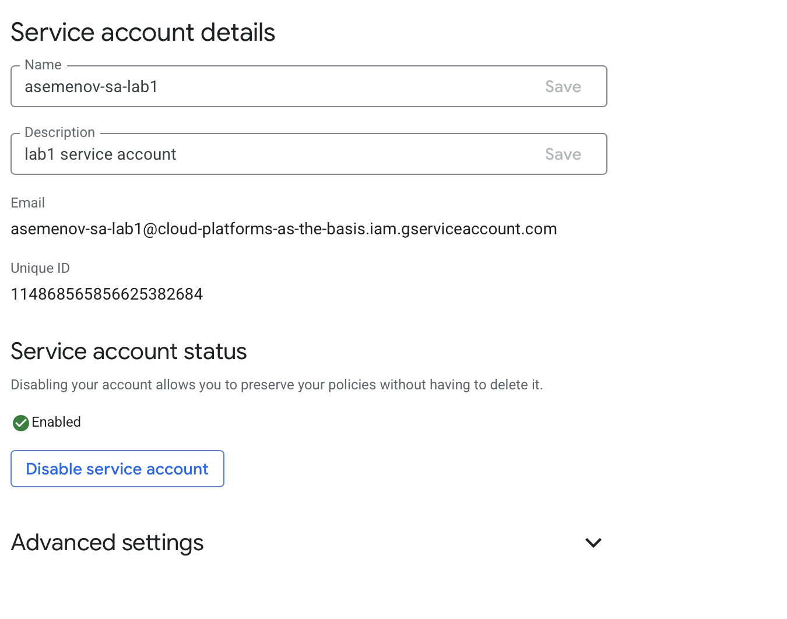
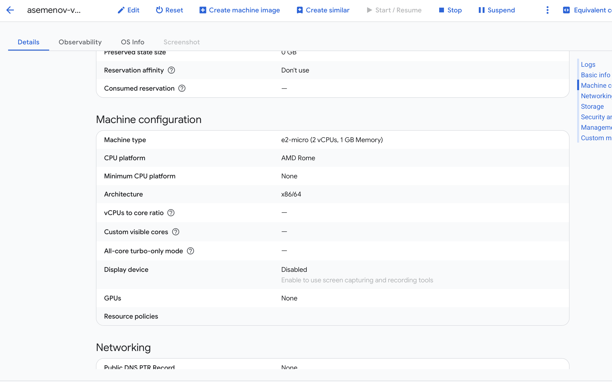
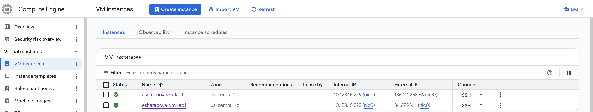
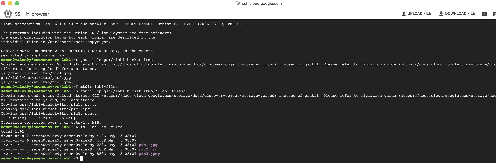
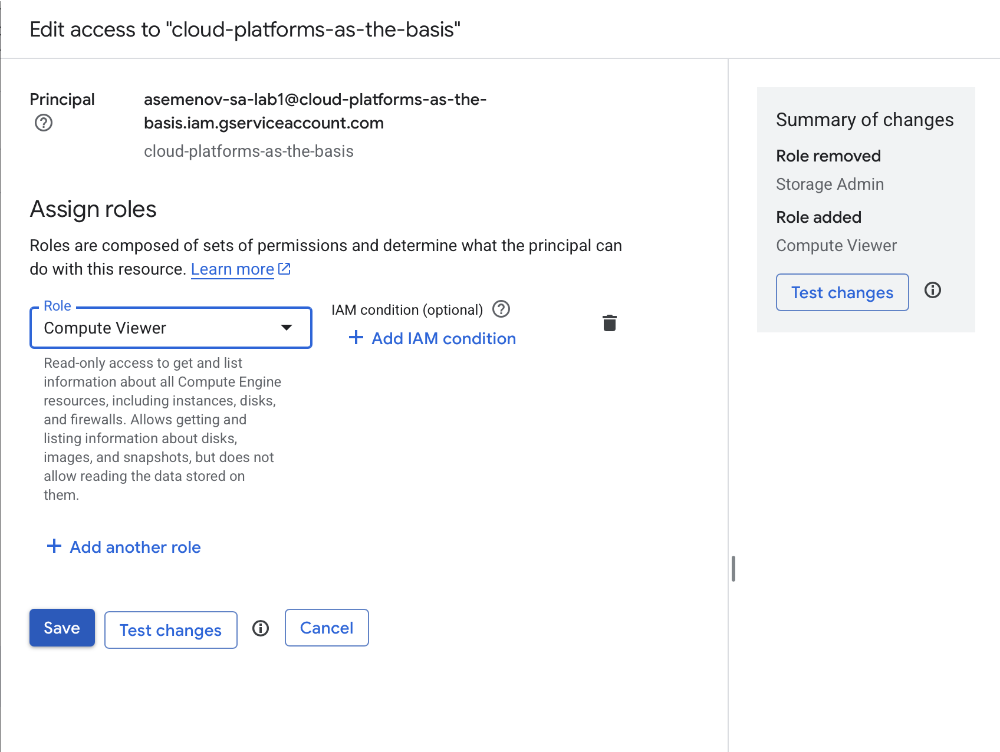
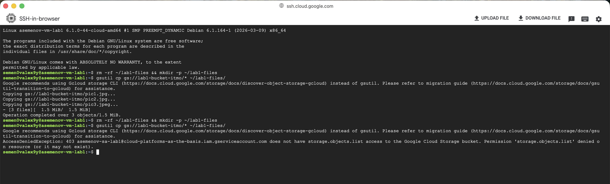
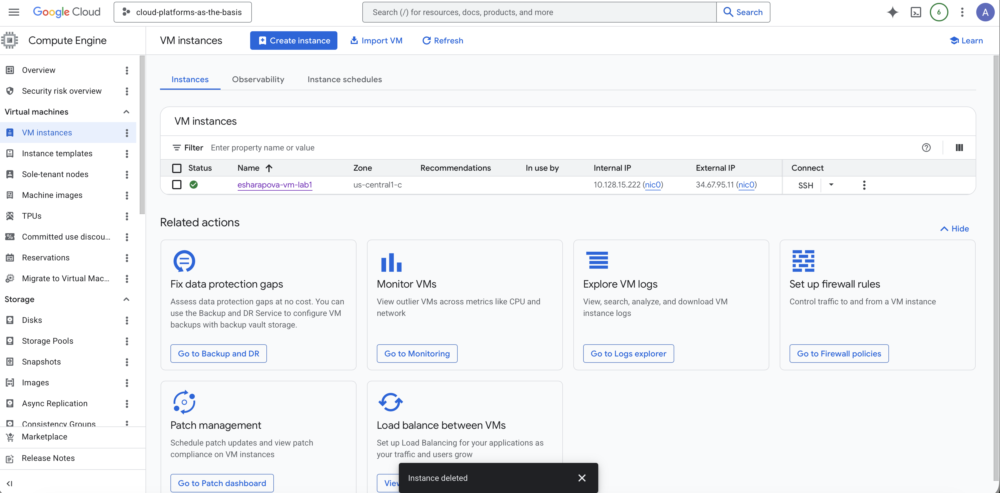

University: [ITMO University](https://itmo.ru/ru/)
Faculty: [FICT](https://fict.itmo.ru)
Course: [Cloud platforms as the basis of technology entrepreneurship](https://)
Year: 2025/2026
Group: U4125
Author: Semenov Aleksey Alekseevich
Lab: Lab1
Date of create: 05.05.2026
Date of finished: 05.05.2026

## Лабораторная работа №1 "Обзор Google Cloud и исследование основных сервисов."

### Цель работы
Ознакомиться с основными возможностями и преимуществами облачной платформы Google Cloud.

### Ход работы

#### 1. Получение доступа к Google Cloud
Заполнил гугл форму, приложив свою Gmail почту, для получения доступа к Google Cloud.


#### 2. Создание Service Account
Зашёл во вкладку IAM и создал service account с ролью `Storage Admin`.

Имя service account: `asemenov-sa-lab1`



#### 3. Создание Compute Engine VM
Создал минимальный compute engine (виртуальную машину) с Machine type `e2-micro` в режиме spot.

Имя VM: `asemenov-vm-lab1`





#### 4. Копирование файлов из бакета `lab1-bucket-itmo`
С помощью утилиты `gcloud` нашёл бакет `lab1-bucket-itmo` и скопировал 3 файла в локальную папку на VM.

```bash
gcloud storage ls gs://lab1-bucket-itmo
gcloud storage cp gs://lab1-bucket-itmo/* ~/lab1-files/
ls -lah ~/lab1-files/
```



#### 5. Изменение прав доступа Service Account
Поменял права доступа для своего service account с `Storage Admin` на `Compute Viewer` и попробовал повторить копирование данных.





**Выводы:** После смены роли с `Storage Admin` на `Compute Viewer` service account потерял права на чтение объектов из Google Cloud Storage. Команда `gcloud storage cp` завершилась с ошибкой доступа (403 Forbidden / Permission denied), так как роль `Compute Viewer` даёт права только на просмотр ресурсов Compute Engine и не предоставляет доступа к Cloud Storage. Это наглядно демонстрирует принцип наименьших привилегий в IAM: каждый сервисный аккаунт должен иметь только те права, которые необходимы для выполнения его задач.

#### 6. Удаление созданных ресурсов
Удалил за собой все созданные сервисы: VM-инстанс и service account.




### Результаты лабораторной работы
В ходе выполнения лабораторной работы:
- Получен доступ к платформе Google Cloud.
- Создан service account `asemenov-sa-lab1` с ролью `Storage Admin`.
- Создана виртуальная машина `asemenov-vm-lab1` (e2-micro, spot) в Compute Engine.
- С помощью утилиты `gcloud` скопированы 3 файла из бакета `lab1-bucket-itmo` на VM.
- Проверена работа IAM при смене роли service account с `Storage Admin` на `Compute Viewer`.
- Все созданные ресурсы удалены.

### Выводы
В результате выполнения лабораторной работы я ознакомился с основными возможностями платформы Google Cloud: системой управления доступом IAM, сервисом Compute Engine и Cloud Storage. На практике увидел, как роли IAM влияют на возможность взаимодействия сервисного аккаунта с ресурсами облака, и убедился в важности корректного назначения прав по принципу наименьших привилегий.

### Полезные ссылки
- [Что такое IAM](https://cloud.google.com/iam/docs/overview)
- [Список основых ролей IAM в GCP](https://cloud.google.com/iam/docs/understanding-roles#cloud-storage-roles)
- [Что такое Google Cloud Storage](https://www.youtube.com/watch?v=VDBhvexAj8I)
- [Что такое Google Cloud Compute Engine](https://cloud.google.com/compute/docs/instances)
