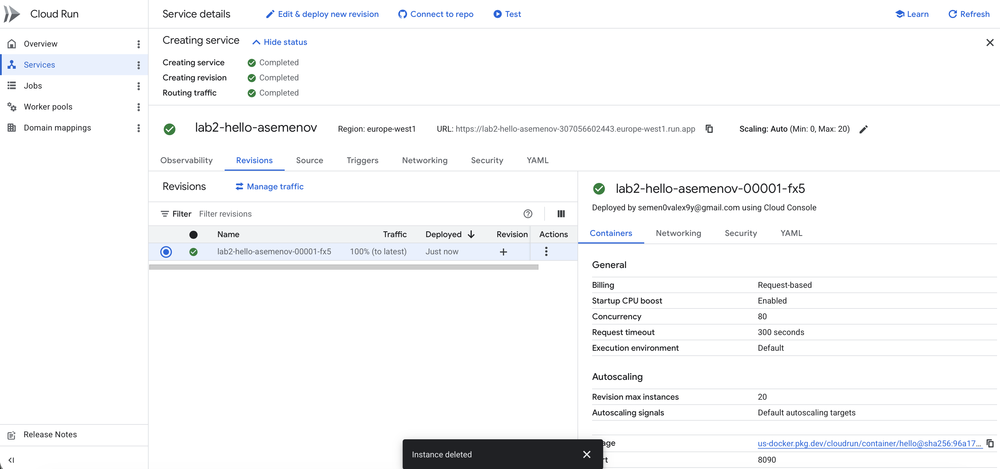
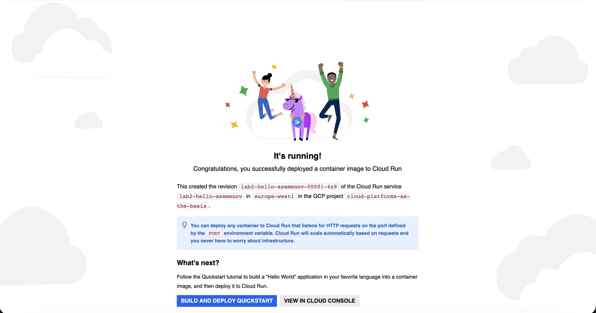
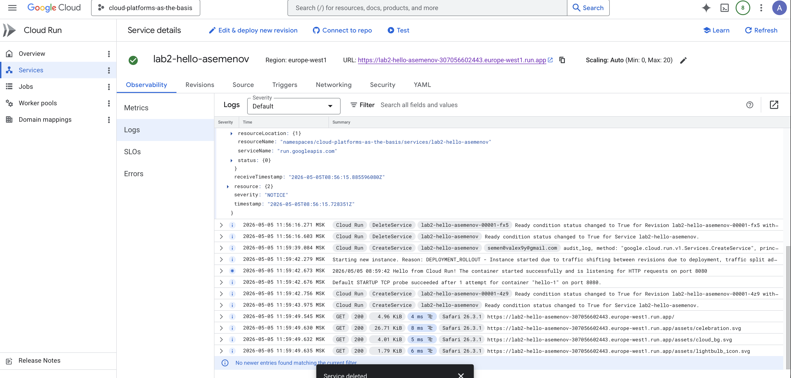
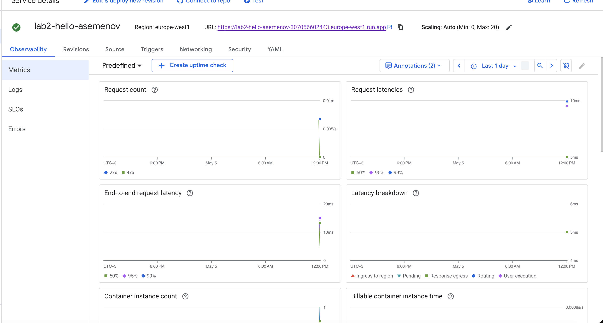
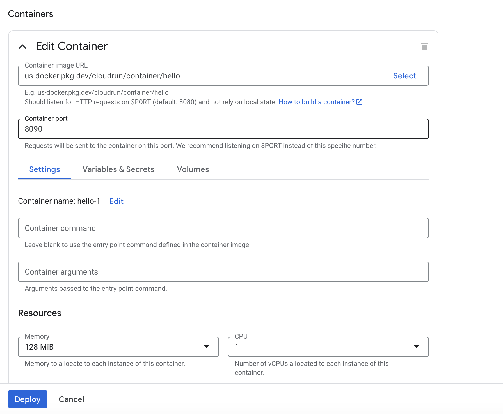
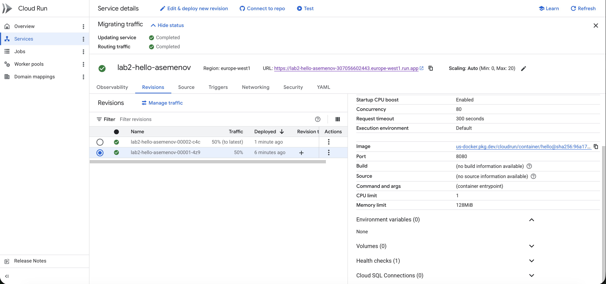
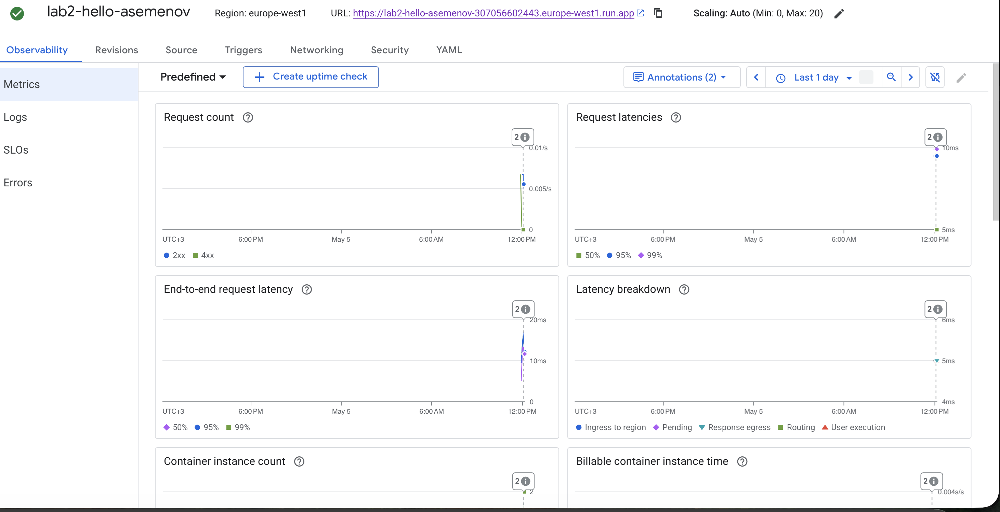
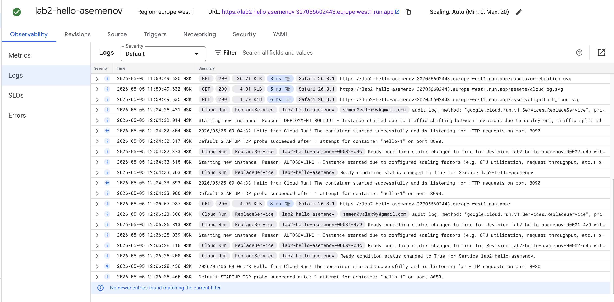
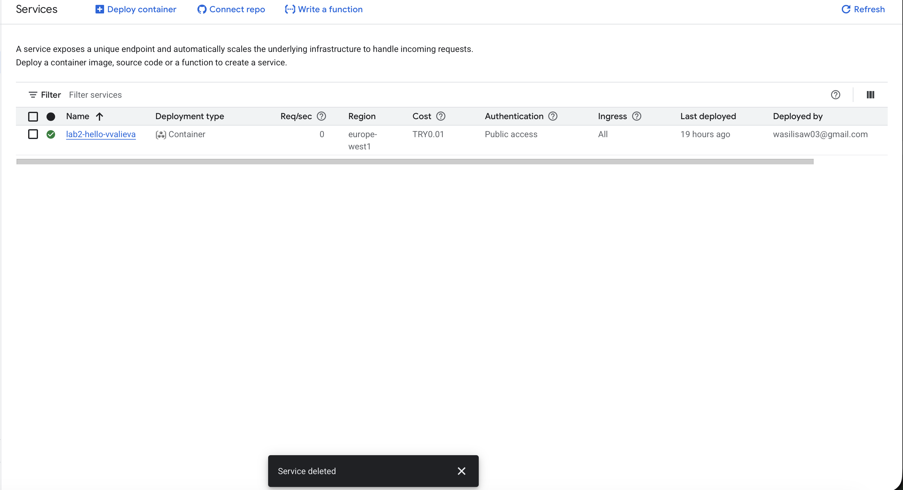

University: [ITMO University](https://itmo.ru/ru/)
Faculty: [FICT](https://fict.itmo.ru)
Course: [Cloud platforms as the basis of technology entrepreneurship](https://)
Year: 2025/2026
Group: U4125
Author: Semenov Aleksey Alekseevich
Lab: Lab2
Date of create: 05.05.2026
Date of finished: 05.05.2026

## Лабораторная работа №2 "Исследование Cloud Run"

### Цель работы
Ознакомиться с работой Cloud Run.

### Ход работы

#### 1. Создание Cloud Run сервиса
Создал Cloud Run сервис из дефолтного образа `Hello` с минимальным количеством ресурсов (1 vCPU, 512 MiB, минимум инстансов — 0).

Имя сервиса: `lab2-hello-asemenov`
Регион: `europe-west1`
128 mib оперативной памяти одно ядро. Все по минимуму

#### 2. Тестирование сервиса
Перешёл по ссылке, предоставленной Cloud Run, и протестировал работу сервиса.

#### 3. Анализ логов и метрик
Перешёл в разделы **Logs** и **Metrics** сервиса, проанализировал данные.

**Наблюдения по логам:** видны записи о запуске контейнера (`Default STARTUP TCP probe succeeded`) и записи о входящих HTTP-запросах с кодами ответа 200, методом, путём и user-agent.

**Наблюдения по метрикам:** видны графики Request count, Request latency, Container CPU/Memory utilization, Container instance count. При первом обращении к сервису видно «холодный старт» (cold start) — задержка первого запроса заметно выше последующих, так как поднимается новый инстанс с нуля.

#### 4. Изменение порта на 8090 и переключение трафика между ревизиями
Отредактировал сервис: в настройках контейнера поменял `Container port` с `8080` на `8090` и задеплоил новую ревизию.

Дальше попробовал переключать трафик между ревизиями (вкладка **Revisions → Manage traffic**): 50% на старую (порт 8080) и 50% на новую (порт 8090).

**Эксперимент:** была предпринята попытка вызвать ошибку `502 Bad Gateway` путём изменения порта контейнера с `8080` на `8090`.

**Результат:**

- Ошибка `502 Bad Gateway` так и **не была получена**.
- Сервис продолжил корректно отвечать `200 OK` со страницей Hello.

**Вывод:**

- Cloud Run не выдаёт ошибку при несовпадении порта, если контейнер корректно использует переменную окружения `$PORT`, которую платформа подставляет автоматически — приложение всё равно слушает тот порт, который ему передал Cloud Run, а не тот, что прописан в UI.
- Поведение системы зависит от конфигурации контейнера и активной ревизии: пока хотя бы одна ревизия здорова и принимает трафик, Cloud Run продолжает успешно отдавать ответы клиенту.

#### 5. Удаление созданных ресурсов
Удалил Cloud Run сервис 

### Результаты лабораторной работы
В ходе выполнения лабораторной работы:
- Создан Cloud Run сервис `asemenov-cr-lab2` из дефолтного образа Hello с минимальными ресурсами.
- Сервис протестирован через публичный URL, выданный Cloud Run.
- Проанализированы логи и метрики сервиса (запросы, latency, CPU/Memory, количество инстансов, cold start).
- Изменён `Container port` с 8080 на 8090, изучено поведение сервиса при несовпадении порта контейнера и порта Cloud Run.
- Проведён эксперимент с переключением трафика между ревизиями (traffic split).
- Все созданные ресурсы удалены.

### Выводы
Cloud Run — это полностью управляемый serverless-сервис для запуска контейнеров: достаточно указать образ и порт, всё остальное (масштабирование, HTTPS, балансировка) платформа берёт на себя. На практике увидел, что:

- Cloud Run автоматически масштабирует сервис от 0 до N инстансов; при минимуме = 0 первый запрос после простоя сопровождается cold start.
- Каждая правка конфигурации создаёт новую **ревизию**, а трафик между ревизиями можно гибко распределять (canary deployments, blue/green, мгновенный rollback).
- Контейнер обязан слушать тот же порт, который указан в настройках Cloud Run, иначе startup probe не проходит и ревизия считается нерабочей.
- Встроенные логи и метрики позволяют сразу видеть проблемы с деплоем и нагрузкой без подключения внешних инструментов.

### Полезные ссылки
- [Как быстро запустить Cloud Run](https://cloud.google.com/run/docs/quickstarts/deploy-container)
- [Cloud Run — управление ревизиями и трафиком](https://cloud.google.com/run/docs/managing/revisions)
- [Cloud Run — настройка контейнера и порта](https://cloud.google.com/run/docs/configuring/containers)
