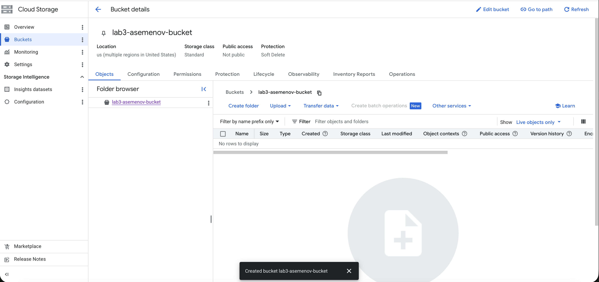
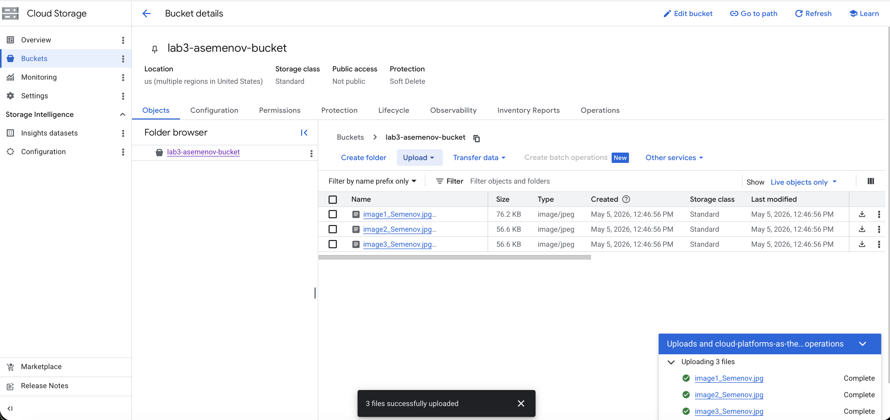
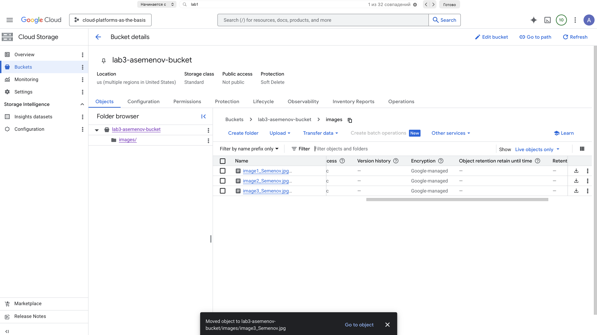
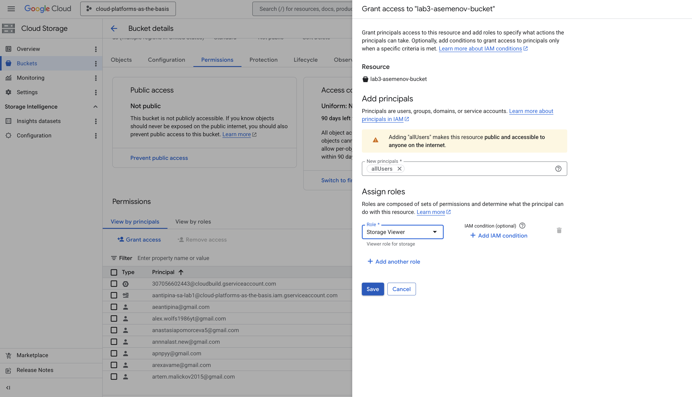
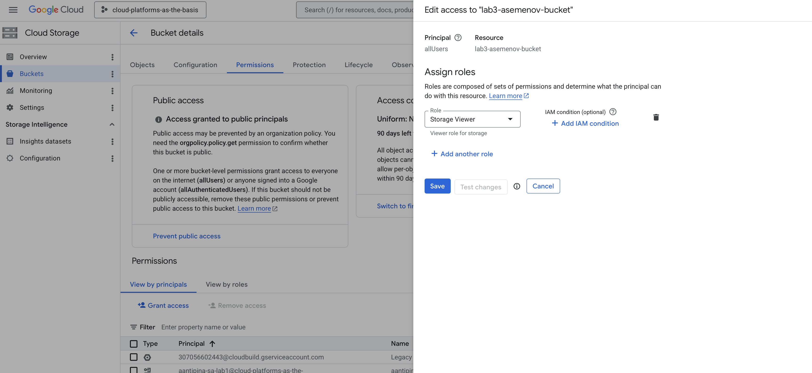
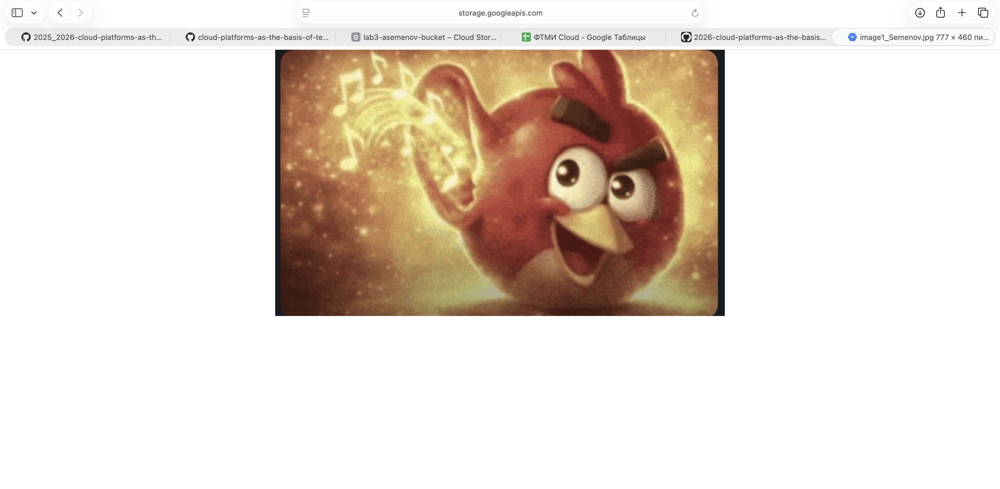
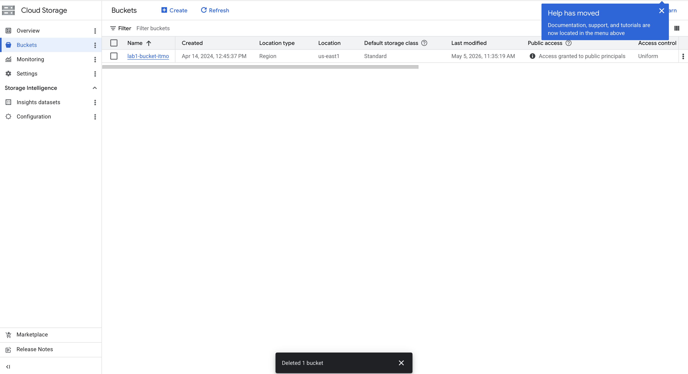

University: [ITMO University](https://itmo.ru/ru/)
Faculty: [FICT](https://fict.itmo.ru)
Course: [Cloud platforms as the basis of technology entrepreneurship](https://)
Year: 2025/2026
Group: U4125
Author: Semenov Aleksey Alekseevich
Lab: Lab3
Date of create: 05.05.2026
Date of finished: 05.05.2026

## Лабораторная работа №3 "Исследование Cloud Storage"

### Цель работы
Ознакомиться с основными понятиями и принципами работы облачного хранилища, изучить различные модели хранения данных (блок, файл, объектное хранилище), познакомиться с основными сервисами и функционалом, предоставляемым облачными хранилищами.

### Ход работы

#### 2. Создание Cloud Storage bucket
Создал Cloud Storage bucket с уникальным именем, выбрав регион хранения и стандартный класс хранилища (Standard).

Имя бакета: `lab3-asemenov-bucket`
Регион: `europe-west1`

#### 3. Загрузка изображений в bucket
Загрузил 3–4 любых изображения в созданный bucket через веб-консоль Cloud Storage.

#### 4. Создание папки и перемещение файлов
Создал папку внутри бакета и переместил загруженные файлы в неё.

Имя папки: `images/`

#### 5. Настройка публичного доступа
Настроил публичный доступ к файлам в настройках приватности (Permissions / Public access). Выдал роль `Storage Viewer` принципалу `allUsers` на уровне объектов / бакета.

#### 6. Создание ссылок на файлы
Через контекстное меню файла получил публичные ссылки вида `https://storage.googleapis.com/lab3-asemenov-bucket/images/image1_Semenov.jpg`.

#### 7. Удаление созданных ресурсов
Удалил все объекты и сам bucket `asemenov-bucket-lab3`.

### Результаты лабораторной работы
В ходе выполнения лабораторной работы:
- Создан Cloud Storage bucket `asemenov-bucket-lab3` (Standard, регион `europe-west1`).
- В bucket загружены 3–4 изображения.
- Создана папка `images/` и в неё перемещены файлы.
- Настроен публичный доступ к файлам (роль `Storage Object Viewer` для `allUsers`).
- Через контекстное меню получены публичные URL и проверены в браузере.
- Все созданные ресурсы удалены.

### Выводы
Cloud Storage — это объектное хранилище Google Cloud, в котором данные организованы в **бакеты** и **объекты**, а не в традиционные «файлы и каталоги»: «папки» в UI — это, по сути, префиксы в именах объектов. На практике увидел, что:

- Создание бакета и загрузка объектов выполняются буквально в пару кликов через веб-консоль; никакой инфраструктуры (диски, файловые системы) при этом самому поднимать не нужно.
- Управление доступом строится через IAM: можно выдать права отдельным пользователям, сервисным аккаунтам или специальному принципалу `allUsers` для публичного доступа.
- Публичная ссылка вида `https://storage.googleapis.com/<bucket>/<object>` работает только когда у `allUsers` есть роль `Storage Object Viewer` — без этой роли запрос вернёт 403.
- Объектное хранилище отлично подходит для статических ассетов (картинки, бэкапы, дистрибутивы), в отличие от блочного (диски ВМ) и файлового (Filestore / NFS), которые решают другие задачи.

### Полезные ссылки
- [Cloud Storage — Quickstart](https://cloud.google.com/storage/docs/quickstart-console)
- [Cloud Storage — управление доступом и публичные объекты](https://cloud.google.com/storage/docs/access-control/making-data-public)
- [Cloud Storage — классы хранилища](https://cloud.google.com/storage/docs/storage-classes)
- [Чем отличаются объектное, блочное и файловое хранилища](https://cloud.google.com/learn/what-is-object-storage)
