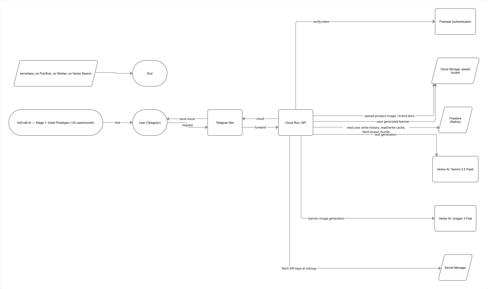
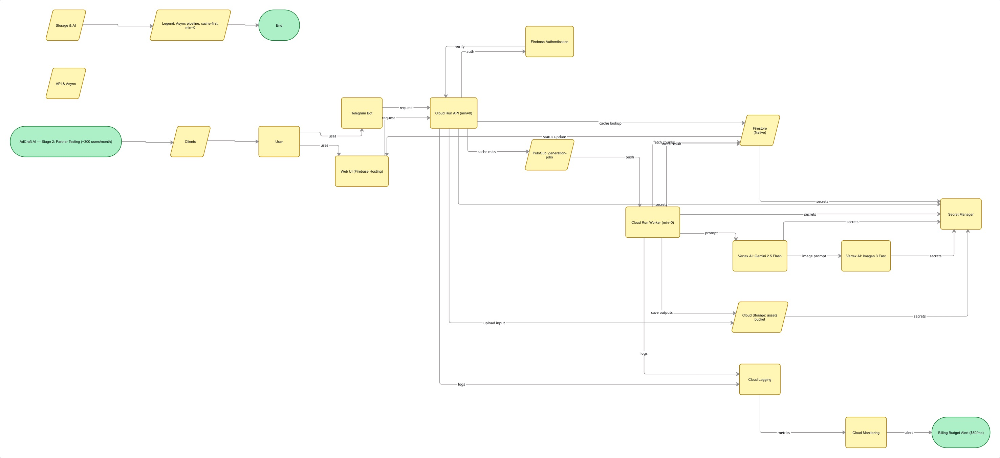
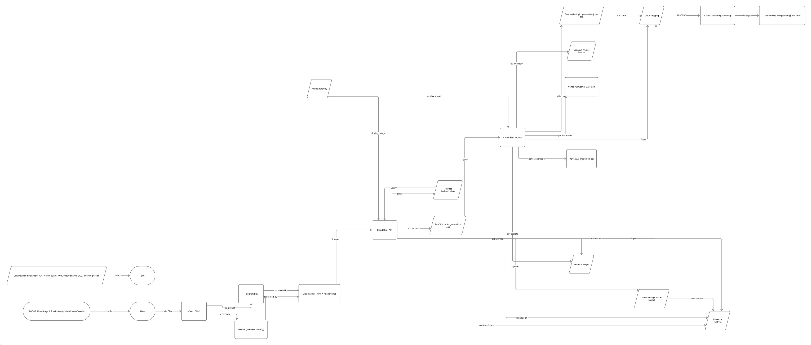

University: [ITMO University](https://itmo.ru/ru/)
Faculty: [FICT](https://fict.itmo.ru)
Course: [Cloud platforms as the basis of technology entrepreneurship](https://)
Year: 2025/2026
Group: U4125
Author: Semenov Aleksey Alekseevich
Lab: Lab4
Date of create: 05.05.2026
Date of finished: 05.05.2026

## Лабораторная работа №4 "Разработка инфраструктуры MVP AI приложения"

### Цель работы
Спроектировать инфраструктуру MVP AI-приложения в Google Cloud для трёх стадий жизненного цикла продукта (начальная, тестирование с партнёрами, production), обосновать выбор сервисов и посчитать экономическую модель.

---

## 1. Описание приложения

**Идея:** SaaS-сервис **AdCraft AI** — AI-помощник по генерации и проверке рекламных креативов для малого e-commerce (Telegram-боты, маркетплейсы, Instagram-витрины).

Пользователь — владелец небольшого магазина или маркетолог-фрилансер. Он загружает карточку товара (название, описание, фото, цена) и параметры аудитории, а сервис возвращает:

1. Несколько вариантов **рекламных заголовков и описаний** для разных площадок (VK Ads, Telegram Ads, Avito, Wildberries карточка).
2. Сгенерированный **баннер-изображение** товара под формат площадки.
3. **Оценку соответствия бренд-гайду** клиента (тональность, запрещённые слова, обязательные дисклеймеры) — через RAG по загруженным бренд-документам.
4. Историю всех ранее сгенерированных креативов и возможность их повторной выдачи без новой оплаты модели.

Функциональные требования:

1. Авторизация через email-magic-link и Telegram OAuth.
2. Загрузка карточки товара (текст + изображения) и бренд-документов (PDF/MD).
3. Генерация креативов (текст + картинка) по запросу.
4. История запросов и кэш ранее сгенерированных результатов (если входные данные совпадают по хэшу — возвращаем готовое, без повторного вызова модели).
5. Личный кабинет с лимитами и подпиской.
6. Базовая модерация (NSFW-фильтр на сгенерированных картинках).

Архитектурно я закладываю:

- **готовые модели через API** (Gemini для текста, Imagen / Vertex AI для изображений) — обучать своё на старте бессмысленно;
- **RAG** по бренд-документам клиента — чтобы модель использовала специфичные знания, а не отвечала «в общем»;
- **serverless first** — платим за реальное использование, без простаивающих ВМ.

---

## 2. Архитектура

Я выбрал **serverless-подход на Google Cloud**, потому что:

- На старте пользователей мало и трафик пиковый — серверы простаивали бы 95% времени.
- Cloud Run / Cloud Functions / Firestore масштабируются «от нуля до тысяч RPS» автоматически и имеют щедрый free tier.
- Меньше DevOps-овых задач — один разработчик может полностью владеть инфраструктурой.

### 2.1. Поток данных

1. Пользователь заходит через **Web UI (Firebase Hosting)** или **Telegram Bot**.
2. Авторизация — через **Firebase Authentication** (email magic link, Telegram OAuth).
3. Запрос летит в **Cloud Run API** (REST + WebSocket для статуса генерации).
4. Загруженные изображения товара и бренд-PDF сохраняются в **Cloud Storage**.
5. Профиль пользователя, история запросов, лимиты подписки и кэш готовых креативов — в **Firestore**.
6. Перед запуском генерации API считает хэш входа (товар + параметры + версия модели). Если такой результат уже есть в кэше → возвращаем его сразу.
7. Если кэш-промах — задача публикуется в **Pub/Sub** (`generation-jobs`).
8. **Cloud Run Worker** (отдельный сервис, концентрация на тяжёлой работе) подписан на топик и обрабатывает задачи по одной.
9. Worker:
   - достаёт релевантные куски бренд-гайда из **Vector Search (Vertex AI Vector Search)**;
   - вызывает **Gemini** для текста и **Imagen** для картинки;
   - прогоняет картинку через **Cloud Vision Safe Search** (NSFW-фильтр);
   - сохраняет готовые ассеты обратно в Cloud Storage, метаданные — в Firestore.
10. UI получает push-уведомление о готовности через WebSocket (или Firestore listener).
11. Все секреты (API-ключи, токены) — в **Secret Manager**.
12. Логи и метрики — **Cloud Logging + Cloud Monitoring**.
13. Биллинг и алерты по бюджету — **Cloud Billing Budgets**.

### 2.2. Схемы инфраструктуры

Схемы построены в Miro и отражают одну и ту же логическую архитектуру в трёх стадиях зрелости. Состав компонентов и обоснование изменений между стадиями — в разделе 4.

#### Стадия 1 — Начальный прототип (≈ 20 пользователей/мес.)

Минимальный набор: пользователь → Telegram Bot → один Cloud Run API, который сам ходит в Firebase Auth, Cloud Storage, Firestore, Vertex AI (Gemini + Imagen) и Secret Manager. Без Pub/Sub, без отдельного Worker, без Vector Search.

#### Стадия 2 — Тестирование партнёрами (≈ 300 пользователей/мес.)

Появляются Web UI на Firebase Hosting, разделение на Cloud Run API и Cloud Run Worker, очередь Pub/Sub `generation-jobs` между ними, кэш в Firestore, Cloud Logging + Cloud Monitoring и Billing Budget alert. Тяжёлая AI-генерация уезжает в асинхронный Worker, чтобы пользовательский запрос не висел десятки секунд.

#### Стадия 3 — Production (≈ 20 000 пользователей/мес.)

К базовой схеме добавляются Cloud CDN перед фронтом, Vertex AI Vector Search для RAG по бренд-документам, Cloud Vision Safe Search для NSFW-проверки сгенерированных картинок, Artifact Registry для образов Cloud Run и расширенная наблюдаемость (Logging → Monitoring → Billing alerts). Базовый поток `Client → API → Pub/Sub → Worker → Vertex AI → Storage/Firestore` остаётся неизменным — стадия 3 это **усиление**, а не переписывание стадии 2.

---

## 3. Обоснование выбора сервисов

| Сервис | Зачем | Альтернативы и почему отказался |
| --- | --- | --- |
| **Cloud Run (API)** | Stateless HTTP-сервис, автоскейлинг от 0, оплата за время запроса. Идеально для редких всплесков на старте. | GKE/Compute Engine — слишком дорого и сложно для MVP; App Engine — менее гибкий, дороже на росте. |
| **Cloud Run (Worker)** | Тяжёлые AI-вызовы хочется отделить от API, чтобы пользовательский запрос не висел 30+ секунд и API можно было независимо масштабировать. | Cloud Functions — лимит таймаута и памяти, под Imagen впритык. |
| **Pub/Sub** | Развязывает API и Worker: API быстро отвечает «принято», Worker берёт задачу из очереди. Гарантирует at-least-once и ретраи. | Cloud Tasks — проще, но хуже для веера подписчиков; нативный SQS-аналог. |
| **Cloud Storage** | Хранение картинок товара, бренд-документов и готовых креативов. Объектное хранилище — нативный формат для файлов. | Firestore не подходит (лимит на размер документа 1 МиБ); файловая система на ВМ — без смысла, не масштабируется. |
| **Firestore** | NoSQL для пользователей, истории, кэша. Не требует администрирования, реалтайм-листенеры из коробки → удобно для UI. | Cloud SQL — дороже, нужен инстанс 24/7; на старте оверкилл. |
| **Vertex AI Vector Search** | Хранение эмбеддингов бренд-документов для RAG. Управляемый ANN-индекс. | Self-hosted FAISS/Qdrant — нужно администрирование; на старте можно вообще обойтись простым in-memory поиском. |
| **Vertex AI: Gemini + Imagen** | Готовые модели для текста и картинок, нативная интеграция с GCP IAM/биллингом. | OpenAI API — нужно отдельно управлять ключами и биллингом, не использует free tier GCP. |
| **Cloud Vision Safe Search** | Дешёвая NSFW-проверка сгенерированных картинок. | Своя модель — долго и дорого для MVP. |
| **Firebase Hosting** | Бесплатный CDN-хостинг для статического Web UI (React/Vite). | Cloud Run для фронта — дороже и сложнее, без CDN. |
| **Firebase Authentication** | Готовые провайдеры (Email link, Google, Telegram через custom token), бесплатно до 50k MAU. | Своё — небезопасно и долго. |
| **Secret Manager** | Хранение API-ключей моделей, ключей вебхуков. | Переменные окружения Cloud Run — менее безопасно, нет ротации. |
| **Cloud Logging / Monitoring** | Логи и алерты на ошибки/аномалии. | Внешние SaaS (Datadog) — дороже на этом масштабе. |
| **Cloud Billing Budgets** | Алерт «потрачено > $X» — критично для AI-стартапа, чтобы не получить счёт на тысячи долларов из-за бага. | — |

---

## 4. Три состояния приложения

### 4.1. Начальный прототип

**Нагрузка:** ≈ 20 пользователей/мес., 30 генераций/мес.

**Состав:**

- Telegram Bot (без Web UI);
- Cloud Run API (1 сервис, без Worker — генерация прямо в запросе, ок при таком трафике);
- Cloud Storage;
- Firestore;
- Firebase Authentication;
- Vertex AI: Gemini + Imagen;
- Secret Manager.

**Почему так:** на старте важна скорость доставки фичи, а не идеальная архитектура. Без Pub/Sub и Worker меньше движущихся частей. Vector Search не используем — бренд-гайдов мало, кладём чанки прямо в Firestore и делаем cosine-similarity в коде.

### 4.2. Тестирование партнёрами

**Нагрузка:** ≈ 300 пользователей/мес., 600 генераций/мес.

**Что добавляется:**

- Web UI на Firebase Hosting (партнёрам нужен нормальный интерфейс, а не только бот);
- разделение Cloud Run на API и Worker;
- Pub/Sub между ними;
- кэш результатов в Firestore (для повторных одинаковых запросов);
- Cloud Logging + дашборд в Cloud Monitoring;
- Cloud Billing Budget с алертом на $50/мес.

**Почему так:** генерация картинки занимает 10–30 секунд — нельзя держать HTTP-запрос открытым. Появились партнёры → нужны SLA и наблюдаемость. Кэш окупается уже на этом масштабе, так как партнёры часто крутят один и тот же товар.

### 4.3. Production

**Нагрузка:** ≈ 20 000 пользователей/мес., 60 000 генераций/мес.

**Что добавляется/меняется:**

- Vertex AI Vector Search вместо самописного поиска (бренд-гайдов уже сотни);
- Cloud Vision Safe Search на сгенерированных картинках (юр. ответственность);
- Cloud CDN перед Firebase Hosting (глобальная аудитория);
- min-instances=1 на API Cloud Run (избавиться от cold start пользовательского запроса);
- min-instances=0 на Worker Cloud Run сохраняем — пиковая нагрузка днём, ночью спит;
- отдельный сервисный аккаунт на каждый сервис, IAM по принципу наименьших привилегий;
- Cloud Armor / rate limiting на API (защита от абуза AI-эндпоинтов).

**Почему так:** архитектура **не ломается** — добавляются усиления и обвязка, но базовый поток (UI → API → Pub/Sub → Worker → Vertex AI → Storage/Firestore) остаётся тем же. Это и есть главное преимущество выбранного подхода: нет «переписать всё на проде».

---

## 5. Экономическая модель

### 5.1. Допущения

| Параметр | Значение |
|---|---:|
| Регион | `europe-west1` |
| Средний размер карточки товара (фото + текст) | 5 MiB |
| Средний размер сгенерированного баннера | 1 MiB |
| Бренд-документы | до 50 MiB на клиента |
| Среднее число генераций | 1.5 на пользователя в месяц |
| Модель текста | Gemini 2.5 Flash |
| Модель картинки | Imagen 3 Fast |
| Embeddings | `text-embedding-004` |
| Входных токенов на 1 генерацию | 6 000 |
| Выходных токенов на 1 генерацию | 1 500 |
| Embeddings на 1 генерацию | 4 000 токенов |
| Картинок на 1 генерацию | 2 шт. |
| Cloud Run | `min instances = 0` (production: API = 1) |
| Хранение | Cloud Storage Standard |
| База данных | Firestore Native |
| OCR / Document AI | не используется |

### 5.2. Стоимость одной новой генерации

| Часть расчёта | Формула | Стоимость |
|---|---:|---:|
| Gemini input | 6 000 / 1 000 000 × $0.30 | $0.0018 |
| Gemini output | 1 500 / 1 000 000 × $2.50 | $0.0038 |
| Embeddings | 4 000 / 1 000 × $0.00015 | $0.0006 |
| Imagen 3 Fast (2 картинки) | 2 × $0.020 | $0.0400 |
| Cloud Vision Safe Search (2 картинки, только prod) | 2 × $0.0015 | $0.0030 |
| **Итого за 1 новую генерацию (MVP/тест)** | | **$0.0462** |
| **Итого за 1 новую генерацию (production)** | | **$0.0492** |

> Цены округлены, актуальны на дату подготовки отчёта (05.05.2026), источники — раздел 7.

### 5.3. Сводная экономика по этапам

| Этап | Польз./мес. | Генераций/мес. | Cache hit | Новых AI-генераций | AI, $/мес. | Инфраструктура после free tier, $/мес. | **Итого, $/мес.** |
|---|---:|---:|---:|---:|---:|---:|---:|
| Начальный прототип | 20 | 30 | 0% | 30 | 1.39 | 0.00 | **1.39** |
| Тестирование партнёрами | 300 | 600 | 15% | 510 | 23.56 | 0.45 | **24.01** |
| Production | 20 000 | 60 000 | 30% | 42 000 | 2 066.40 | 78.40 | **2 144.80** |

### 5.4. Детализация инфраструктуры после free tier

| Сервис | Прототип, $/мес. | Тестирование, $/мес. | Production, $/мес. |
|---|---:|---:|---:|
| Cloud Run API + Worker | 0.00 | 0.00 | 18.00 |
| Cloud Storage | 0.00 | 0.10 | 12.50 |
| Firestore | 0.00 | 0.05 | 6.20 |
| Pub/Sub | 0.00 | 0.00 | 1.20 |
| Vertex AI Vector Search | 0.00 | 0.00 | 18.00 |
| Firebase Hosting + CDN | 0.00 | 0.00 | 4.50 |
| Firebase Authentication | 0.00 | 0.00 | 0.00 |
| Cloud Logging / Monitoring | 0.00 | 0.20 | 12.00 |
| Secret Manager | 0.00 | 0.05 | 0.80 |
| Artifact Registry | 0.00 | 0.05 | 1.20 |
| Cloud Armor | 0.00 | 0.00 | 4.00 |
| **Итого** | **0.00** | **0.45** | **78.40** |

### 5.5. Доли расходов в production

| Категория | $/мес. | Доля |
|---|---:|---:|
| AI-вызовы (Gemini + Imagen + Embeddings + Vision) | 2 066.40 | 96.3% |
| Инфраструктура GCP | 78.40 | 3.7% |
| **Итого** | **2 144.80** | 100% |

**Вывод:** на production-этапе **96% бюджета — это сами AI-вызовы**, а не инфраструктура. Любая оптимизация, которая режет число вызовов модели (кэш, дедупликация по хэшу, апселл «больше шаблонов из одной генерации»), даёт кратно больший экономический эффект, чем выбор более дешёвой ВМ.

### 5.6. Эффект кэша в production

| Вариант | Новых генераций/мес. | AI, $/мес. | Инфра, $/мес. | Итого, $/мес. |
|---|---:|---:|---:|---:|
| С кэшем 30% | 42 000 | 2 066.40 | 78.40 | **2 144.80** |
| Без кэша | 60 000 | 2 952.00 | 78.40 | **3 030.40** |

**Экономия от кэша:** $885.60/мес. ≈ **$10 627 в год**.

---

## 7. Источники цен

1. Cloud Run pricing — https://cloud.google.com/run/pricing
2. Firestore pricing — https://cloud.google.com/firestore/pricing
3. Cloud Storage pricing — https://cloud.google.com/storage/pricing
4. Pub/Sub pricing — https://cloud.google.com/pubsub/pricing
5. Vertex AI (Gemini, Imagen, Embeddings) pricing — https://cloud.google.com/vertex-ai/pricing
6. Vertex AI Vector Search pricing — https://cloud.google.com/vertex-ai/pricing#vectorsearch
7. Cloud Vision API pricing — https://cloud.google.com/vision/pricing
8. Secret Manager pricing — https://cloud.google.com/secret-manager/pricing
9. Artifact Registry pricing — https://cloud.google.com/artifact-registry/pricing
10. Cloud Logging / Monitoring — https://cloud.google.com/stackdriver/pricing
11. Firebase Hosting / Auth pricing — https://firebase.google.com/pricing
12. Cloud Armor pricing — https://cloud.google.com/armor/pricing

## 8. Выводы

- Для AI-MVP оптимален **serverless-first** подход на Google Cloud: на старте — почти бесплатно (укладываемся в free tier), на росте — без переписывания кода и архитектуры.
- Главная статья расходов в production — **сами AI-вызовы** (~96%), а не инфраструктура. Поэтому ключевые механики экономии — **кэш** и **дедупликация запросов**, а не выбор более дешёвых ВМ.
- Архитектура построена так, что переход между стадиями — это **добавление компонентов, а не замена**. Базовый поток `Client → API → Pub/Sub → Worker → Vertex AI → Storage/Firestore` остаётся неизменным.
- Обязательны **Cloud Billing Budgets** с раннего этапа: одна ошибка в коде, гоняющая модель в цикле, способна сжечь месячный бюджет за пару часов.
